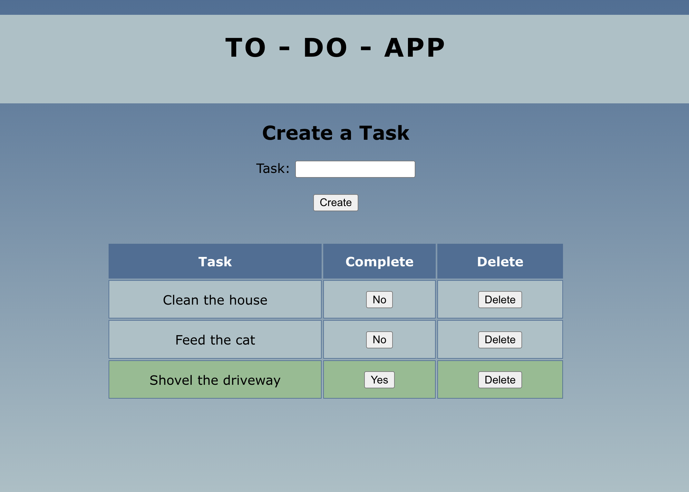

# To-Do List

## Description
Duration: 2 Weeks

This project allows the user to input a task and use the create button to save it to a database and be displayed in a table below. Each task that is added to the database gets displayed on the table with a complete button and a delete button. The complete button allows the user to mark a task as complete in the database and change the background color of that task to green. The delete button allows the user to delete the task and remove it from the database and table.

## Screenshot

## Prerequisites
-Node.js
-React
-PostgreSQL

## Installation
1. Create a database using PostgreSQL named `weekend-to-do-app`
2. Create the table and insert the values as shown in database.sql
3. Run `npm install` in your terminal
4. Run `npm run server` in your terminal
5. Run `npm run client` in a different terminal window
