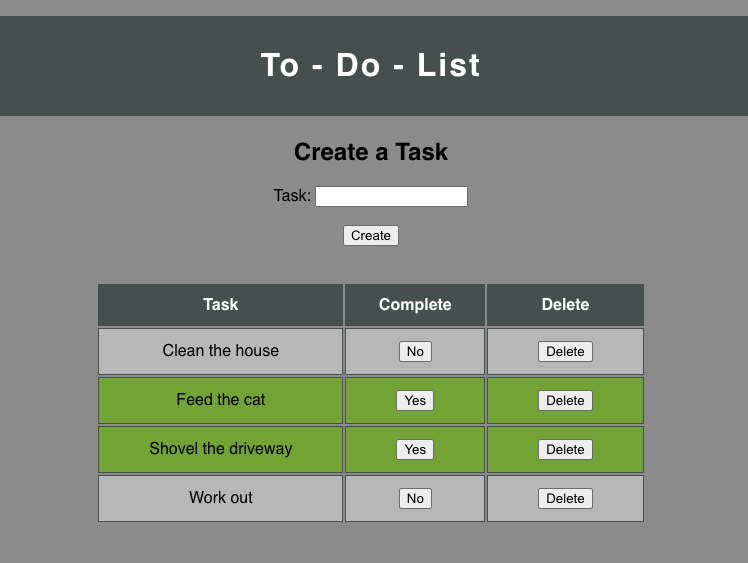

# To-Do List

## Description
Duration: A few days over a 2 week period

This project contains a To-Do List application that allows the user to create tasks that will be stored in a database and displayed in a table below. The user can mark a task as complete or delete a task from the database/table.

## Preview

## Installation / Setup
1. Clone down this repository. You will need node and npm installed globally on your machine.
2. Create a database named `weekend-to-do-app`
3. Create the table and insert the values as shown in `database.sql`
4. In your editor of choice, run `npm install` in your terminal
5. Run `npm run server` in your terminal
6. Then run `npm run client` in a different terminal window

## Usage
The user can create a task by typing in a task name and clicking the submit button or pressing enter. This will add the task to the database and display it in the table below. Whether or not a task is complete is stored in the database (default = no) along with the task name.

The user can mark a task as complete by clicking on the complete button labeled `No`. This will change the background color of that task and the label of the complete button to `Yes`. 

The user can delete a task by clicking on the delete button. This will delete the task from the database and remove it from the table.

## Built With

- Javascript
- React
- Axios
- PostgreSQL

## Acknowledgements

Thanks to Prime Digital Academy for teaching me how to do all of this cool stuff!

## Support

If you'd like to discuss this project or encounter any issues, please email me at erichjohnengler@gmail.com

Thanks for checking this out!

